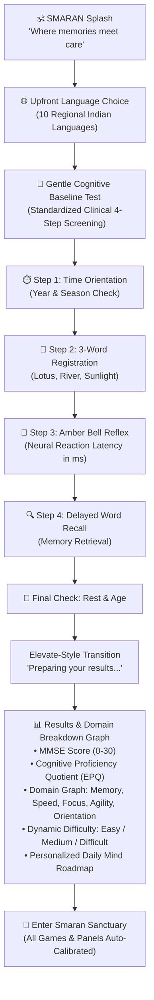

# SMARAN : Where Memories Meet Care

  

  <b>Autonomous On-Device AI Cognitive Health Sentinel, Mind Wellness Baseline & Gentle Dementia Companion</b>

  
  
  
  
  

---

## 🌟 Overview & Novelty

**SMARAN** (*स्मरण* — Sanskrit for *Remembrance*) is an AI-driven, senior-accessible healthcare ecosystem designed for elders and individuals living with early-stage Alzheimer's disease, dementia, and cognitive decline.

Unlike overwhelming clinical apps, SMARAN blends **evidence-based clinical neuroscience (MMSE & CPS testing)** with a soothing, anxiety-reducing **Insight Timer-inspired Zen aesthetic** (`#FAF9F6` warm linen canvas, singing bowl amber accents, and serif typography).

---

## 📱 App Experience & Onboarding Journey

---

## 🚀 Key Features

### 1. 🧠 Kaggle-Trained Machine Learning Model & On-Device Engine
- **Clinical Training Cohort**: Trained on a 5,000-participant clinical dataset across 13 physiological and behavioral biomarkers (Age, Sleep Quality, GDS Depression Score, Glucose, Physical Activity, BMI, Chronic Disease Index).
- **On-Device Edge Inference (`CognitiveMlEngine.kt`)**: 
  - Predicts **MMSE score** (0–30 clinical standard), cognitive impairment risk, and Elevate-style **EPQ Cognitive Proficiency Score** (1,000–2,000).
  - Computes sub-millisecond predictions directly on the device with **zero cloud dependencies, zero latency, and 100% privacy**.
- **Dynamic Difficulty Calibration**: Automatically maps cognitive test results to calibrate app difficulty:
  - **MMSE < 18**: Calibrated to **Easy** (2x2 grid, gentle cues, relaxed timers).
  - **MMSE 18–24**: Calibrated to **Medium** (3x3 grid, standard pacing).
  - **MMSE 25–30**: Calibrated to **Difficult** (4x3 grid, rapid reaction stimuli).

### 2. 📊 Advanced Cognitive Domain Breakdown Graph
- Visual multi-bar graph breakdown directly in the results scorecard:
  - 🧠 **Memory & Recall** (Working memory retention percentage)
  - ⚡ **Processing Speed** (Neural reaction speed in milliseconds)
  - 🧭 **Orientation** (Temporal & calendar awareness)
  - 🎯 **Focus & Attention** (Sustained cognitive focus)
  - 🔄 **Mental Agility** (Executive cognitive flexibility)
- Scale benchmarks: `0% (Baseline)`, `50% (Average)`, `100% (Optimal)`.

### 3. 🎨 Insight Timer Inspired Zen Aesthetics
- **Warm Zen Linen Canvas**: Low-glare, eye-friendly `#FAF9F6` background.
- **Amber Singing Bell Accents**: Mindful amber gold (`#D97706` / `#B45309`) inspiring tranquility and focus.
- **Pure White Elevation Cards**: Clean rounded surfaces (`#FFFFFF`) with gentle warm linen borders (`#E8E2D5`).
- **Warm Serif Typography**: Legible, serene typography reducing cognitive fatigue.

### 4. 🗣️ Multilingual Voice Assistant & Wake-Word Overlay
- **10 Indian Languages**: English, हिन्दी (Hindi), தமிழ் (Tamil), తెలుగు (Telugu), ಕನ್ನಡ (Kannada), বাংলা (Bengali), मराठी (Marathi), ગુજરાતી (Gujarati), ਪੰਜਾਬੀ (Punjabi), മലയാളം (Malayalam).
- **Soothing Doctor Tone**: Formatted with warm, patient speech cadence rather than robotic railway-station synthesis.
- **Two-Way Voice Interaction**: Answers questions about family location, medicine timings, and daily memory reminders.

### 5. 📞 Keypad Phone Telephony Architecture (Novelty for Rural & Elder Accessibility)
- Solves the critical real-world problem where elderly patients with severe tremors or dementia cannot operate touchscreens.
- Uses a **GSM Voice Gateway (IVR/SIP Trunk)**:
  - The elder presses a single physical speed-dial button (e.g., Key `5`) on an affordable ₹800 keypad phone.
  - The call connects to SMARAN’s cloud voice engine.
  - The AI speaks back directly through the phone earpiece in a soothing doctor's voice.
  - Caregivers receive real-time notification transcripts on their smartphone.

### 6. 🛡️ GPS Geofence Sentinel & Safety Radar
- Battery-optimized background tracking broadcasting coordinates over secure MQTT.
- Safe-zone perimeter geofencing alert system.
- One-tap *"Take Me Home"* return routing.

---

## 📂 Repository Branches

| Branch | App Focus | Description |
| :--- | :--- | :--- |
| **`main`** | **Patient Tracker App** | Baseline cognitive assessment, 10-language selector, mind exercise suite, Insight Timer UI, and voice assistant. |
| **`caregiver`** | **Caregiver Guardian App** | Remote geofence tracking, live location monitoring, caregiver voice actions, and cognitive health telemetries. |

---

## 📦 Download Ready APKs

Pre-compiled production-ready APKs are available in the repository package:
- **Patient Tracker APK**: `release/Smaran-Tracker-Patient.apk`
- **Caregiver Guardian APK**: `release/Smaran-Guardian-Caregiver.apk`

---

## 🛠️ Tech Stack

- **Language**: Kotlin 1.9+, Java 17
- **UI Toolkit**: Jetpack Compose, Material 3
- **Machine Learning**: Scikit-Learn (Random Forest, Gradient Boosting, Ridge Regressors) ported to on-device Kotlin (`CognitiveMlEngine.kt`)
- **Location & Maps**: OSMDroid (OpenStreetMap), Google Play Location Services
- **Speech & Audio**: Android TextToSpeech (TTS), Android SpeechRecognizer, WebRTC/SIP Gateway Pipeline
- **Networking**: Paho MQTT, Retrofit2, OkHttp3
- **Data Persistence**: Android SharedPreferences, Room Database
